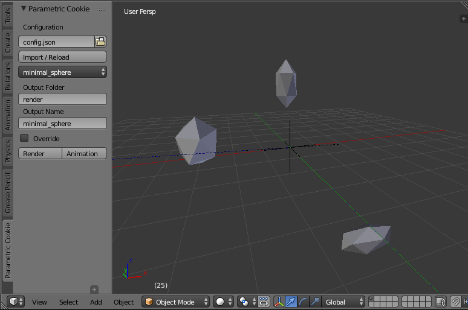

# Parametric Cookie

Coding and scripting add-on for Blender. 

This add-on offers configurable coding and scripting with Blender by running scripts in the background or within Blender. It is particularly useful for generative animations that are fully scripted with the Blender API. This add-on evolved as a helpful tool through creating most of the pieces in the [Parametric Cookie](https://parametriccookie.tumblr.com/) Collection.

## Installation
Download the Parametric Cookie Add-on from Github as an [archive](https://github.com/njanakiev/parametric-cookie/archive/master.zip). Go to _File > User Preferences > Addons > Install from File_ and then choose the zip-archive and activate the flag besides the Parametric Cookie Add-on.

## Getting Started
There are a few examples to illustrate the functionality in the [examples](examples) folder. You can run them by extracting the examples folder from the archive, selecting the [config](examples/config.json) file in the file picker in the toolbar and pressing the _Import / Reload_ button below. This loads the scene defined in the configuration file. Below the button you can choose which scripted scene to choose from (which are again located in the examples folder).

